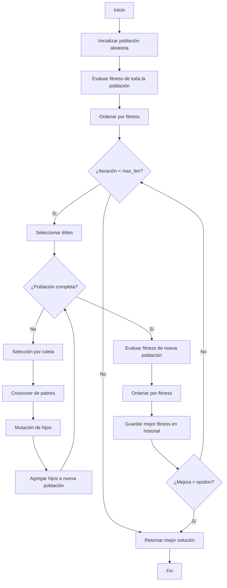

## Introducción

La optimización es un campo de estudio amplio y muy interesante. No solo resulta satisfactorio desde el punto de vista teórico, sino que también es extremadamente útil en la práctica. Cuando hablamos de optimización, la idea principal que suele venirnos a la cabeza es la de realizar una tarea de la mejor manera posible, utilizando la menor cantidad de recursos.

En nuestro día a día, que suele ser bastante ajetreado, todos intentamos optimizar distintos procesos cotidianos: limpiar, cocinar, desplazarnos, estudiar o trabajar, entre otros. De forma consciente o no, tomamos decisiones orientadas a ahorrar tiempo, esfuerzo o dinero, lo que constituye un ejemplo claro de optimización aplicada a la vida diaria.

En el ámbito del comercio, la optimización es un elemento casi inherente al propio sistema capitalista (al menos en su formulación teórica más ideal). Las empresas compiten entre sí tratando de ofrecer mejores bienes y servicios, y esta competencia actúa como motor para la mejora continua de los procesos. Por ejemplo, si una empresa de reparto de paquetes consigue realizar sus envíos de forma más rápida y utilizando menos combustible que otra, podrá ofrecer precios más competitivos. Al reducir el consumo de recursos, esta empresa más eficiente puede mantener (o incluso aumentar) su margen de beneficio frente a otra cuyo proceso logístico sea menos eficiente.

Este tipo de situaciones ilustran claramente problemas de optimización. En el caso del transporte, existen múltiples rutas posibles entre distintos destinos, pero no todas son igualmente buenas. El objetivo es encontrar el recorrido óptimo en función de ciertas variables, como el tráfico en un momento determinado, la existencia de obras, la distancia entre puntos de entrega o el consumo de combustible. La optimización permite modelar este problema y determinar, entre todas las alternativas posibles, aquella que minimiza el coste total o maximiza la eficiencia del proceso.

Dentro de este campo de estudio existen multitud de herramientas matemáticas y de métodos para optimizar un problema. Como breve resumen, enumeraré algunos de los sistemas más usados:

- **Algoritmos basados en gradiente**: utilizan información de derivadas de la función objetivo para guiar la búsqueda hacia óptimos locales o globales. Son muy eficientes cuando la función es continua y diferenciable (por ejemplo, descenso por gradiente o métodos de *Newton*).
- **Metaheurísticas**: métodos de búsqueda aproximada inspirados en procesos naturales o estrategias probabilísticas. No garantizan el óptimo global, pero son muy útiles en problemas complejos, no lineales o discontinuos. En este blog hablaré sobre los algoritmos genéticos, el ejemplo más básico de metaheurística.
- **Métodos exactos**: técnicas matemáticas que garantizan encontrar la solución óptima, como la programación lineal, entera o convexa. Suelen ser computacionalmente costosos y aplicables solo a problemas con una estructura bien definida.
- **Métodos heurísticos**: estrategias diseñadas específicamente para un tipo de problema concreto, que priorizan la rapidez frente a la optimalidad. Son comunes en problemas de gran escala o en tiempo real.

Para poder definir un problema general como un problema de optimización, es necesario establecer ciertos elementos fundamentales que lo definan de manera clara y precisa. Matemáticamente, y de forma simplificada, un problema de optimización tiene esta forma:

$$
\begin{aligned}
\text{Función objetivo a minimizar} \quad & f(x) \\
\text{sujeto a} \quad 
& g_j(x) \le 0, \quad j = 1,2,\ldots,s, \\
& h_j(x) = 0, \quad j = 1,2,\ldots,w, \\
& x_i, \quad i = 1,2,\ldots,n.
\end{aligned}
$$

De forma resumida, tenemos una función que queremos minimizar o maximizar, junto con una serie de restricciones que hay que cumplir. En el ejemplo del transportista, lo que queremos es gastar el menor combustible posible, pero con la condición de que no podemos pasar por las calles $x$ e $y$ debido a las obras, y de que hay que visitar todas las casas del recorrido.

A continuación explicaré brevemente algunos conceptos que son indispensables para entender el diseño de los métodos de optimización.

## Conceptos clave

### Función objetivo

Esta función establece el objetivo a alcanzar para la resolución de nuestro problema. Puede evaluar como de "buena" es una solución, es una forma de cuantificar el rendimiento. También puede ser vista como una forma de cuantificar un error. En ese caso, deberíamos minimizarla.

### Óptimos globales y locales



Si imaginamos una función como una superficie, quizá semejante a una cadena montañosa, con picos y llena de valles y depresiones. Así es más sencillo entender estos conceptos. Un óptimo global sería encontrar el punto más bajo de toda la superficie, el valle más profundo de la región. En la búsqueda por descender lo máximo posible, es posible quedarse atrapado en depresiones menos profundas que, en relación con su entorno inmediato, son las más bajas. Estos son los óptimos locales.

Un senderista que se mueve por este terreno no tiene una visión completa del paisaje. Solo percibe la pendiente inmediata que le rodea. Su estrategia es simple: avanzar siempre cuesta abajo.

Siguiendo esta regla, el senderista acabará llegando a un punto donde todas las direcciones cercanas ascienden. Desde su punto de vista, ha alcanzado el fondo del valle: cualquier paso que dé lo hará subir. Sin embargo, ese punto puede no ser el lugar más bajo de toda la región, sino solo el más bajo en su entorno inmediato. Ese punto corresponde a un óptimo local.

Algunos métodos topan con la misma problemática del senderista. Se quedan atascados en valores subóptimos.

Dentro de todos los métodos de optimización existentes, hay unos que son bastante divertidos e interesantes. Son fáciles de programar, intuitivos y generalmente funcionan muy bien. Estos son las **metaheurísticas**. Estos son métodos cuyo principal característica es la aleatoriedad como motor principal de exploración. Y concretamente dentro de estos algoritmos, voy a hablar de los algoritmos genéticos.

## Algoritmos genéticos

La premisa es básica. Esta familia de algoritmos se inspiran en las ideas de *Darwin* sobre la evolución, más concretamente en los mecanismos de selección natural y supervivencia del más apto, donde los individuos mejor adaptados al entorno tienen mayor probabilidad de reproducirse y transmitir sus características a la siguiente generación.

Estos algoritmos (y todas las metaheurísticas) tienen dos fases generales. La exploración y la explotación.

### Exploración y explotación

Como he mencionado antes, la aleatoriedad es una parte clave de estas técnicas. Esta característica permite explorar zonas del espacio que quizá no habrían sido visitadas en primera instancia por parecer menos prometedoras. Gracias a ello, se permite una exploración más amplia y una habilidad que permite al algoritmo escapar de óptimos locales. Esta primera fase de búsqueda es la conocida como **exploración**.

La **explotación** viene justo después. Esta es la habilidad de refinar y ajustar lo máximo posible una zona de soluciones, encontrando la mejor solución posible dentro de esta.

El balance entre ambas fases es muy sensible y muy necesario. Si la exploración dominase, el algoritmo tardaría mucho tiempo en conseguir una solución, o incluso no convergería a ninguna. En cambio, si la explotación fuese más fuerte que la exploración, la convergencia sería muy prematura y posiblemente se encontraría una solución subóptima, cuando podría haber muchas mejores opciones sin descubrir.

Los algoritmos genéticos son capaces de explorar y explotar gracias a su variada selección de operadores. Aunque antes de hundirnos en detalles sobre estos, hay que entender el algoritmo de forma general.

Las **GAs** trabajan con una población de soluciones codificadas normalmente en forma binaria. Cada solución, llamada cromosoma, está compuesta por genes (*bits*), y el conjunto de cromosomas constituye la población. Esta población se inicializa de manera aleatoria para favorecer la exploración del espacio de soluciones y, posteriormente, cada cromosoma es evaluado según su calidad, lo que permite ordenar las soluciones de mejor a peor.

A partir de esta evaluación comienza el proceso evolutivo, que se desarrolla en generaciones. En cada una se seleccionan los cromosomas más aptos para reproducirse, aplicando el principio de supervivencia del más apto sin eliminar completamente la diversidad. Los operadores genéticos principales son el cruce, que combina información de dos progenitores para generar nuevas soluciones, y la mutación, que introduce cambios aleatorios para evitar la convergencia prematura. Con apoyo del elitismo, que preserva las mejores soluciones, este ciclo se repite hasta cumplir un criterio de parada, tomando finalmente el mejor cromosoma como solución aproximada al problema. A continuación proporciono un diagrama general del ciclo evolutivo:


### De la teoría a la práctica

Dentro del diseño principal de los genéticos, hay una variedad muy grande de operadores. A lo largo de los años han ido surgiendo distintos diseños y evoluciones de los operadores básicos. Aquí implementaré los más sencillos.

La siguiente clase contiene los parámetros de inicialización del algoritmo. El parámetro `fitness_func` hace referencia a la función *fitness*. Esta es la función objetivo que vamos a maximizar. Veremos que de esta también depende la calidad de nuestra solución, pues hay múltiples formas de abordar la evaluación de un cromosoma. El resto de parámetros son evidentes: el tamaño de la población, número de genes de cada solución, probabilidad de mutación por gen, iteraciones máximas, mejora mínima por generación (cuando deja de mejorar un mínimo el algoritmo para), probabilidad de cruce, porcentaje de elitismo en función del tamaño de la población y una semilla (por reproducibilidad en experimentación).

La población se genera siguiendo una distribución discreta uniforme, pero esto es cuestión de diseño, podría utilizarse otra distribución.

```python
class GA:
    def __init__(
        self,
        fitness_func: Callable,
        population_size: int,
        num_genes: int,
        mutation_rate: float,
        max_iter: int,
        epsilon: float,
        crossover_rate: float = 0.8,
        elitism_rate: float = 0.1,
        seed: Optional[int] = None,
    ):
        self.fitness_func = fitness_func
        self.population_size = population_size
        self.num_genes = num_genes
        self.mutation_rate = mutation_rate
        self.max_iter = max_iter
        self.epsilon = epsilon
        self.crossover_rate = crossover_rate
        self.elitism_rate = elitism_rate
        self.best_fitness_history = []
        if seed is not None:
            np.random.seed(seed)
            random.seed(seed)

    def initialize_population(self) -> np.ndarray:
        self.population = np.random.randint(
            low=0, high=2, size=(self.population_size, self.num_genes)
        )
        return self.population
```

El operador de cruce es sencillo. Este concretamente recibe el nombre de *one-point crossover* ya que se selecciona un punto al azar entre las dos soluciones padre. 



Dado ese punto de corte, se mezcla la parte izquierda de un padre con la parte derecha de otro y viceversa, generando en el proceso dos soluciones hijo.

```python
def crossover(
        self, x1: np.ndarray, x2: np.ndarray
    ) -> Tuple[np.ndarray, np.ndarray]:
        if np.random.rand() > self.crossover_rate:
            return x1.copy(), x2.copy()
        point = np.random.randint(1, x1.size)
        c1 = np.concatenate([x1[:point], x2[point:]])
        c2 = np.concatenate([x2[:point], x1[point:]])
        return c1, c2
```

El operador de mutación, en el caso de la mutación binaria, no tiene mucho misterio. Se recorre cada gen de un cromosoma, generando un número aleatorio por cada iteración. Con una probabilidad baja se realizará esa mutación, que consiste en un cambio del *bit*. Si era $0$ cambia a $1$ y viceversa. Esta probabilidad suele ser baja para evitar que el proceso se vuelva excesivamente aleatorio y se pierda la información genética acumulada por selección y cruce.

Este operador introduce aleatoriedad en el algoritmo, de forma que se favorece a la exploración del espacio de soluciones.

```python
def mutate(self, x: np.ndarray) -> np.ndarray:
        for i in range(x.size):
            if np.random.rand() < self.mutation_rate:
                x[i] = 1 - x[i]
        return x
```

El operador de selección es uno de los componentes fundamentales de los algoritmos genéticos y se encarga de decidir qué individuos de la población pasan a reproducirse y, por tanto, a transmitir su información genética a la siguiente generación. Su funcionamiento se basa en el principio de la supervivencia del más apto, es decir, los que mejor evaluación tienen dada la función *fitness*. En este caso he implementado una ruleta, que es sencilla de programar y de entender. La probabilidad de selección de cada individuo es proporcional a su aptitud.

```python
def roulette_wheel(self, scores: np.ndarray) -> np.ndarray:
        if np.sum(scores) == 0 or np.count_nonzero(scores) < 2:
            return np.random.choice(len(scores), 2, replace=False)
        probs = scores / np.sum(scores)
        return np.random.choice(len(scores), 2, replace=False, p=probs)
```

Finalmente, una vez se han explicado los operadores, queda la evolución generacional. Como he mencionado, se modifica la población completa generación tras generación siguiendo el siguiente bucle: Selección de padres, cruce de padres, mutación y reemplazo de la población. El elitismo es opcional, pero he optado por añadirlo ya que en mi experiencia no promueve una convergencia muy temprana si el número es bajo y mejora mucho la calidad de las soluciones.

```python
def optimize(self) -> np.ndarray:
        population = self.initialize_population()
        scores = self.fitness_func(population)

        idx = np.argsort(scores)[::-1]
        population = population[idx]
        scores = scores[idx]

        prev_best = scores[0]
        elite_size = int(self.elitism_rate * self.population_size)

        for it in range(self.max_iter):
            new_population = []

            elites = population[:elite_size]
            new_population.extend(elites)

            while len(new_population) < self.population_size:
                i1, i2 = self.roulette_wheel(scores)
                p1, p2 = population[i1], population[i2]
                c1, c2 = self.crossover(p1, p2)
                c1 = self.mutate(c1)
                c2 = self.mutate(c2)
                new_population.append(c1)
                if len(new_population) < self.population_size:
                    new_population.append(c2)

            population = np.array(new_population)
            scores = self.fitness_func(population)

            idx = np.argsort(scores)[::-1]
            population = population[idx]
            scores = scores[idx]

            best = scores[0]
            self.best_fitness_history.append(best)

            improvement = best - prev_best
            if 0 < improvement < self.epsilon:
                print(
                    f"Early stopping at iteration {it + 1}: improvement ({improvement:.6f}) < epsilon ({self.epsilon})"
                )
                break

            prev_best = best

        return population[0]
```

## El problema de la mochila

Como problema de ejemplo para optimizar y visualizar el comportamiento de este algoritmo he escogido el *problema de la mochila* o *Knapsack Problem*, un clásico.



Este consiste en seleccionar, de entre un conjunto de objetos con un peso y un valor asociados, aquellos que deben introducirse en una mochila con capacidad limitada para maximizar el valor total sin exceder dicha capacidad.

Para poder trabajar en este problema con algoritmos genéticos, la codificación de las soluciones será un vector binario, donde cada gen representa un objeto candidato a ser introducido en la mochila: el valor $1$ indica que el objeto es seleccionado y el valor $0$ que no lo es.

$$
\mathbf{x} = (x_1, x_2, \dots, x_n), \quad x_i \in \{0,1\}, \quad
x_i =
\begin{cases}
1 & \text{si el objeto } i \text{ es seleccionado} \\
0 & \text{en caso contrario}
\end{cases}
$$

$$
W(\mathbf{x}) = \sum_{i=1}^{n} w_i x_i \leq W_{\max}
$$

$$
V(\mathbf{x}) = \sum_{i=1}^{n} v_i x_i
$$

En esta formulación, $\mathbf{x}$ es una solución candidata formada por $n$ objetos, $x_i$ indica la selección del objeto $i$, $w_i$ y $v_i$ representan respectivamente el peso y el valor del objeto $i$, $W(\mathbf{x})$ es el peso total de la solución, $W_{\max}$ la capacidad máxima de la mochila, y $V(\mathbf{x})$ el valor total de la solución, que se utiliza como función *fitness*.
